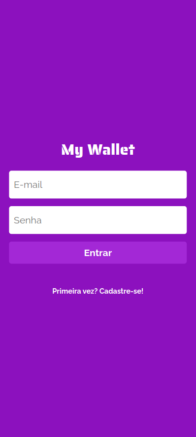
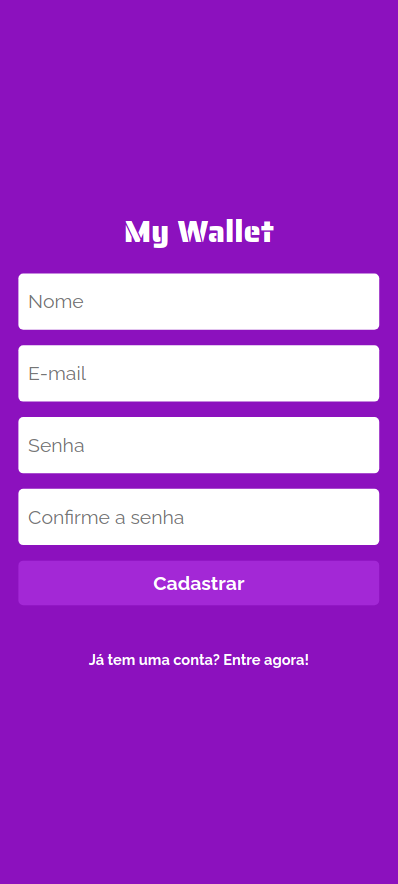
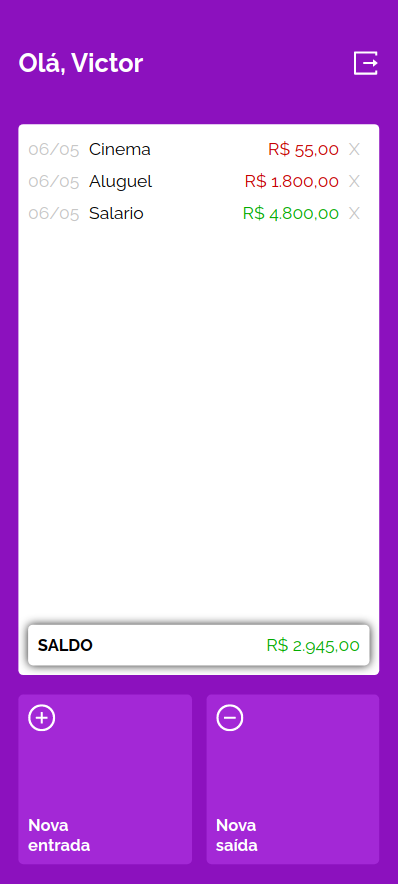
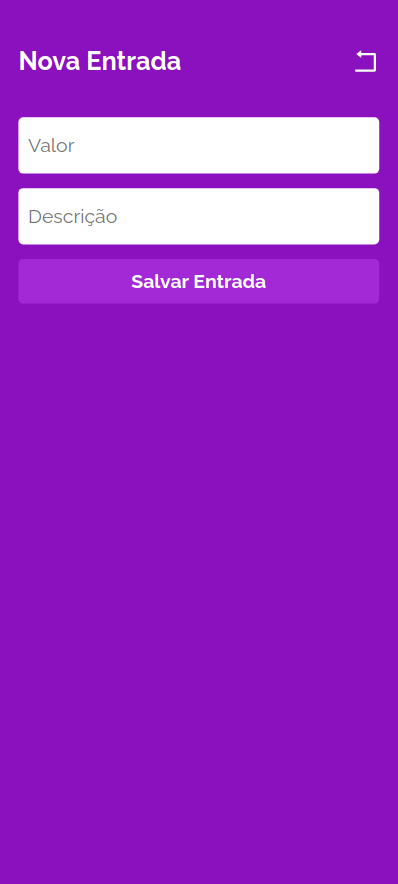
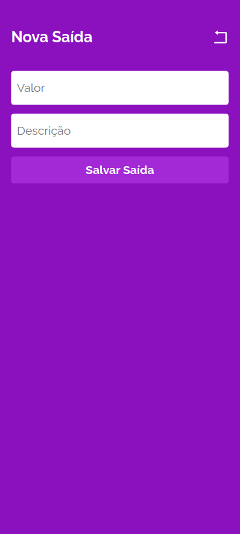
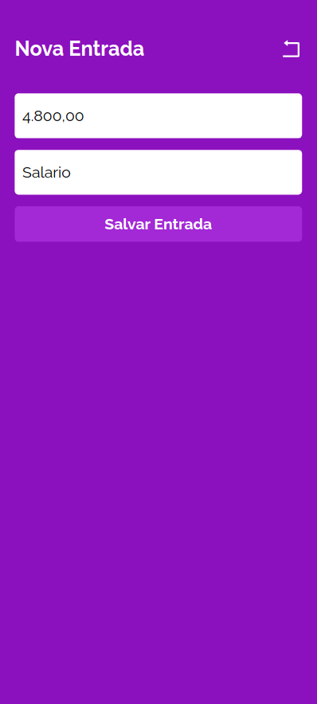
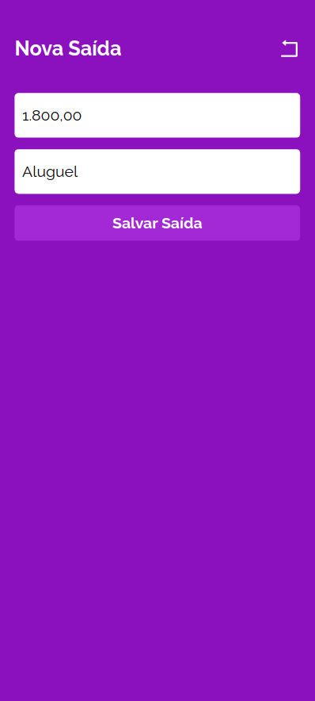

# My Wallet App Front-end

Front-end for My Wallet, a finance manager. :moneybag:

## About

My Wallet is a web browser application with which you can manage your personal expenses and income. This application was build with `Create React App` and styled with `styled-components`.

[Figma Layout](https://www.figma.com/file/p37uJdpZWRLED7YEwDFfUd/MyWallet?type=design&t=MA6lwbQegpQapTH1-0)

You can access the back-end repository at [Back-End APP](https://github.com/victor-azevedo/back-mywallet)

[Deploy](https://victor-dev-mywallet.vercel.app/sign-in)
Note: you must run the back-end server in your machine. Access the backend repository and follow the steps to run the server.

## How to run

#### Requirements

- Have Node.js installed in your machine.
- [Run back-end application](https://github.com/victor-azevedo/back-mywallet)

1. Clone this repository;

```bash
git clone git@github.com:victor-azevedo/front-mywallet.git
cd front-mywallet/
```

2. Install all dependencies:

```bash
npm i
```

3. Create a `.env` file based in `.env.example`;

4. Start application:

```bash
npm start
```

Application will run in default PORT: 3000.
Note: Default API URL: http://localhost:4000

## Samples

 
 
 
 
