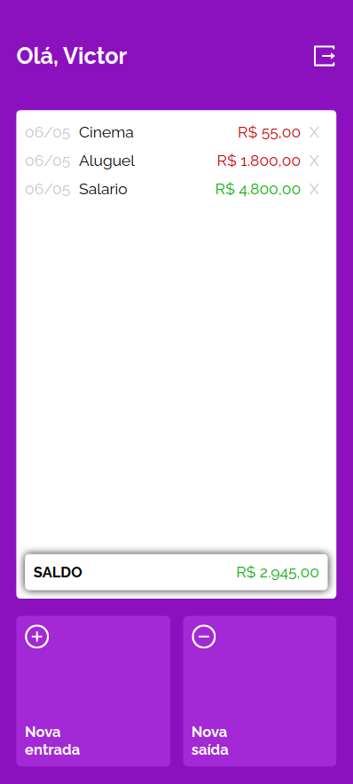
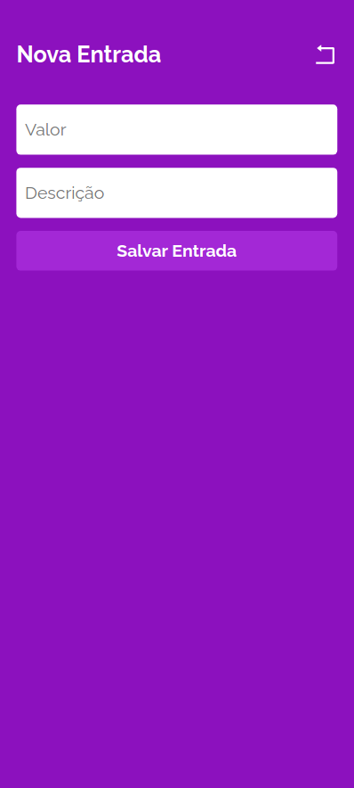
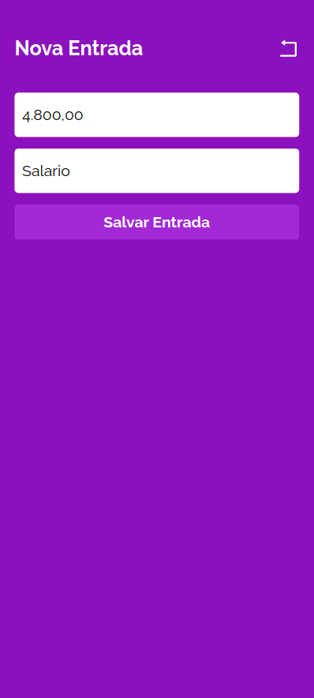

| [:gb:](README.md) | [:brazil:](README_pt.md) |

# My Wallet - Fron-end

Front-end para o My Wallet, um gerenciador financeiro. :moneybag:


## Sobre

O My Wallet é um aplicativo web com o qual você pode gerenciar suas despesas e receitas pessoais. Esta aplicação foi construída com `Create React App` e estilizada com `styled-components`.

[Layout no Figma](https://www.figma.com/file/p37uJdpZWRLED7YEwDFfUd/MyWallet?type=design&t=MA6lwbQegpQapTH1-0)

Você pode acessar o repositório do back-end em [Back-End APP](https://github.com/victor-azevedo/back-mywallet)

## Deploy

Você pode acessar a aplicação [aqui](https://victor-dev-mywallet.vercel.app)

## Como executar:

#### Requisitos

- Tenha o Node.js instalado em sua máquina.
- [Execute a aplicação back-end](https://github.com/victor-azevedo/back-mywallet)

1. Clone este repositório;

```bash
git clone git@github.com:victor-azevedo/front-mywallet.git
cd front-mywallet/
```

2. Instale todas as dependências:

```bash
npm i
```

3. Crie um arquivo `.env` com base no arquivo `.env.example`;

4. Inicie a aplicação:

```bash
npm start
```

A aplicação será executada na porta padrão: 3000.
Observação: URL padrão da API: http://localhost:4000

## Exemplos

 
 
 
 
